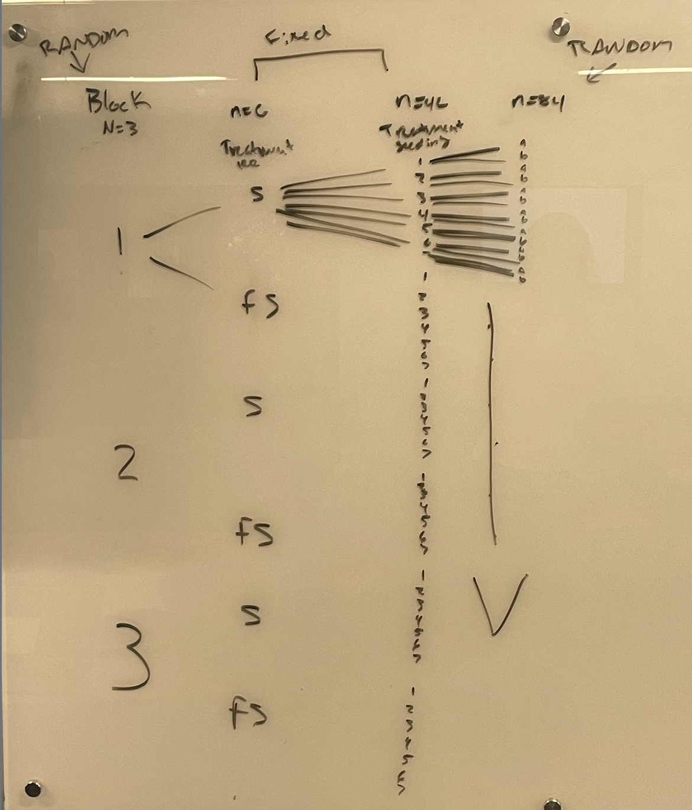

```{r setup, include=FALSE}
knitr::opts_chunk$set(message = FALSE,
                      warning = FALSE)
options(show.signif.stars = FALSE)

library(ggplot2)
library(ggthemes)
library(tidyverse)
library(car)
library(effects)
library(readxl)
library(mosaic)
library(remotes)
library(ggResidpanel)
library(easyalluvial)
library(emmeans)
library(patchwork)
library(plotly)
library(gtsummary)
library(lme4)
library(nlme)
library(lmerTest)
library(catstats2)
library(qqplotr)
library(lattice)
webshot::install_phantomjs(force = T)
theme_set(theme_bw()) #Prevents need for + theme_bw() in ggplots
```


# Previous data wrangling:


```{r}
GripStrengthMeasurements <- read_excel("GripStrengthMeasurementsS25.xlsx")
GS <- GripStrengthMeasurements %>% drop_na(GripStrength) #Mostly cleans out empty rows

GS2 <- GS %>% drop_na(Arm)
GS2 <- GS2 %>% mutate(Arm = forcats::fct_collapse(Arm,
                                                Up = c("Up", "up"),
                                                Down = c("Down", "down"),
                                                "90" = c("90", "90 degree")),
                    SubjectID = forcats::fct_collapse(SubjectID,
                                          MDEarl = c("MDEarl","MDEar")),
                    Arm = factor(Arm),
                    Hand = factor(Hand),
                    OrderF = factor(Order)
)

GS2 <- GS2 %>% mutate(Hand.Arm = factor(str_c(Hand, Arm)))

GS2 <- GS %>% drop_na(Arm)
GS2 <- GS2 %>% mutate(Arm = forcats::fct_collapse(Arm,
                                                Up = c("Up", "up"),
                                                Down = c("Down", "down"),
                                                "90" = c("90", "90 degree")),
                    SubjectID = forcats::fct_collapse(SubjectID,
                                          MDEarl = c("MDEarl","MDEar")),
                    Arm = factor(Arm),
                    Hand = factor(Hand),
                    OrderF = factor(Order)
)
Demographics <- read_excel("DemographicsS25.xlsx")
Demographics <- Demographics %>% dplyr::select(-c(12:13)) #Because of a "note" left in column 13...
Demographics <- Demographics %>% mutate(SubjectID =
                forcats::fct_recode(SubjectID,
                   LADeathGrips = "LADeath",
                   CenntenialWarriors = "CentennialWarriors")
)

Demographics <- Demographics %>% mutate(Weights = factor(Weights),
                                        GripTesterID = factor(GripTesterID))

Demographics <- Demographics %>% mutate(Weights = fct_collapse(Weights,                                                              no = c("no",  "No"),
               yes = c("yes", "Yes")))

#Join Demographics to the GS2 repeated measures data
combined <- left_join(x = GS2, y = Demographics, by = "SubjectID")

combinedR <- combined %>% drop_na()

combinedR <- combinedR %>% mutate(forearm_bins   = 
                                    factor(cut_number(ForearmLength, n = 3)),
                                  epworth_bins = 
                                    factor(cut_number(Epworth, n = 3)),
                                  balance_bins = 
                                    factor(cut_number(BalanceTime, n = 3))
                                  )
combinedR <- combinedR %>% mutate(
                forearm_bins = fct_recode(forearm_bins,
                                       low = "[9.25,10]",
                                       medium = "(10,11]",
                                       high = "(11,13.1]")
            )
lmer3 <- lmer(GripStrength ~ Hand*Arm + forearm_bins + GripTesterID + (1|SubjectID), data = combinedR)
```


## Part I: Final Grip Strength model: Three-level model (from the end of lab 12)


**1) The previous model for grip strength failed to account for groups and that you were nested into groups for taking measurements that might also be systematically different on grip strength. Modify `lmer3` to fit a new model account for group and then make a new  `model_diagram` and generate an `Anova` set of F-tests for the model. No discussion.**

```{r}
lmer4 <- lmer(GripStrength ~ Hand*Arm + forearm_bins + GripTesterID + (1|GroupName/SubjectID), data = combinedR)

Anova(lmer4, test.statistic = "F")
model_diagram(lmer4, heightVal = 800)
```

**2) Discuss how the denominator DF from the F-tests loosely/qualitatively relate to the `model_diagram` results for the Grip Tester, forearm, and Hand fixed effects. Report how many unique values were present at each level (provided in the model diagram) and the denominator DF in the discussion. Note that this is not about a formula but about relative size and number of unique observations at each level, _since the denominator DF can't be more than the number of unique observations at each level_.**

The model diagram shows 11 groups, 43 subjects, and 257 observations. 
The denominator DF generally make sense because the griptester DF is 5.739, forearm_bins is 33.920, and hand, arm, hand:arm all have denominator DF of 209.006. These relative sizes line up with the unique values in our model diagram for the levels where these groups were applied. 


**3) Generate a caterpillar plot from your new model. Find your group or a group of interest to you. Discuss the relative location of that group and, if you know something about the group, discuss whether this result is something you expected given how we formed the groups based on height of the students. **

At the group level, the TallerThanYou group had relatively higher estimated mean grip strength than the rest of the groups, and the average.  This makes sense as these individuals were the tallest in their class last semester, and included PATaller who had the highest grip strength of all. 

```{r}
ranef(lmer4)
dotplot(ranef(lmer4, postVar = T))
```


## Part II: Complex field study multi-level model

* Read Uselman et al. (2018) and focus on the study design (Figure 2) and the results for the "South" field for Shrub Density (Table 2) and their 3-factor model. We won't consider all the interactions of the fixed effects and will handle some of the variables slightly differently below.  

* Uselman, SM, Davison, J, Baughman, OW, Sullivan, BW, Miller, WW, and EA Leger (2018) Restoring dryland old fields with native shrubs and grasses: Does facilitation and seed source matter? _PLoS ONE_ 13(10): e0205760. https://doi.org/10.1371/journal.pone.0205760


```{r}
Uselman <- read_csv("Uselman_data.csv", na = "-")
UselmanR <- Uselman %>% dplyr::filter(Site == "South") %>%
  mutate(Date = factor(Date)) %>%
  dplyr::filter(Date == "16-May") %>%
  mutate(SeedingStrat = factor(SeedingStrat),
         Irrigation = factor(Irrigation),
         GrassOrig = factor(GrassOrig),
         Blockf = factor(Block),
         logShrubDens25 = log(ShrubDens2016 + 0.025),
         Block = factor(Block),
         SubBlock = factor(SubBlock),
         Plot = factor(Plot))

UselmanR <- UselmanR %>%  mutate(SeedingStrat = factor(SeedingStrat),
         Irrigation = factor(Irrigation),
         GrassOrig = factor(GrassOrig),
         SeedingStrat.ShrubOrig = factor(str_c(SeedingStrat, ShrubOrig)),
         SeedingStrat.ShrubOrig = forcats::fct_na_value_to_level(SeedingStrat.ShrubOrig, "V")
         )

```


**4) Work on the whiteboards to develop and write out a model diagram for the study design described in Figure 2 with predictors of just Seeding Strategy and Irrigation. The diagram will not be graded for correctness, but take a picture of the diagram you develop and read the file into the document.**

* You can read image files into Rmd's by placing them in the same location as the Rmd and using something like `` on a separate line in the file and not within a codechunk, depending on the type of image file you generate.




**5) What is Seeding Strategy level "V" in the study design?**

Seeding Strategy level "V" is the seeding control where they did not seed in anything. 


**6) The authors used shrub origin and seeding strategy and their interaction (among other things) in their three-factor model in Table 2. Report their test statistic and distribution under the null for the seeding strategy by shrub orig interaction in that three-factor model. What do the numerator DF in the table tell you about the number of levels for seeding strategy and shrub origin in this model?**

$F_{3,28} = 10.80$ , $p-value <0.001$

The numerator df would say that there are 4 seeding strategies being used for the 2 different shrub origins. 


**7) The code above creates a variable called `SeadingStrat.ShrubOrig`. Explain the levels of SeedinStrat.ShrubOrig, especially as it relates to level Seeding Strategy Level V and why there were missing data on the shrub origin variable.**


SeedinStrat.ShrubOrig creates levels that are the combination of the seeding strategy and the shrub origin. So for example strategy IV would have two levels in this variable called IVLocal and IVDistant. Seeding strategy V is the control and there is no seeding being done, so it does not apply in the new variable as there is no seeding of shrubs to combine. 

```{r}
UselmanR %>% 
  dplyr::select(SeedingStrat, ShrubOrig, SeedingStrat.ShrubOrig) %>% 
  alluvial_wide()
```


**8) The following models attempt to fit models to account for the nested measurements in the study design with block, "subblocks" in blocks (shaded areas in their Figure 2), and plots in subblocks in blocks (the numbers 1 to 7 that are then split into A and B parts at the dashed line in their Figure 2 - more or less the rows within the subblocks). The models are fit two ways, one using the forced nesting notation and the other trying to have `lmer` find the nesting structure using the additive notation for the random effects. What changed between the two models in terms of the counts of levels in the random effects?**

The counts in levels of random effects for lmerU4 differ from lmerU4A in the group count. lmerU4 is the forced nesting option and creates 42 separate groups for the plot:SubBlock:Block, whereas the lmerU4A only shows 7 that account for the different seeding strategies. lmerU4A then did not split the seeding strategy into random effect groups. 

lmerU4: Number of obs: 84, groups:  Plot:SubBlock:Block, 42; SubBlock:Block, 6; Block, 3
lmerU4A: Number of obs: 84, groups:  Plot, 7; SubBlock, 6; Block, 3

```{r}
lmerU4 <- lmer(logShrubDens25 ~ 1 +  (1|Block/SubBlock/Plot), data = UselmanR)

lmerU4A <- lmer(logShrubDens25 ~ 1 +  (1|Block) + (1|SubBlock) + (1|Plot), data = UselmanR)

summary(lmerU4)
summary(lmerU4A)
```


**9) It can be good to explore the random effect levels and combinations you are using with an alluvial diagram. Modify the provided code to make one of the `Block`, `SubBlock`, and `Plot`. No discussion.**

```{r}
UselmanR %>% dplyr::select(Block, SubBlock, Plot) %>% alluvial_wide(fill_by = "first_variable")
```


**10) The issue in the "additive" random effect model notation is that `Plot` reused the same coding of 1 to 7 for different locations within different blocks and plots. What is needed is a unique code for each plot, something like `PlotID`, not a code that is generic and recycled across those higher level units. You can use the `str_c` function to fuse together the block, subblock, and plot information and create a new variable that uniquely identifies each plot. Replace `Plot` in the previous alluvial diagram and color the alluvia based on the new variable. How can you explain the "Number of flows" information in the alluvial diagram based on the study design?**


```{r fig.height = 12}
UselmanR <- UselmanR %>% mutate(PlotID = str_c(Block, SubBlock, Plot))

UselmanR %>% dplyr::select(Block, SubBlock, PlotID) %>% alluvial_wide(fill_by = "first_variable")
```


**11) Replace the `Plot` in the "additive" code version of the lmer model above with the uniquely coded version of the variable you created, `PlotID`. Also incorporate the fixed effects of the `SeedingStrat.ShrubOrig` variable which contains all the combinations of those two variables, `Irrigation`, and their interaction. How many levels does the new version of the "plot" that you created have in the model?**

The PlotID level now has 42 levels! 

```{r}
lmerInt <- lmer(logShrubDens25 ~  SeedingStrat.ShrubOrig*Irrigation +  (1|Block) + (1|SubBlock) + (1|PlotID), data = UselmanR)

summary(lmerInt)
```


**12) Fit the same model as in the previous question using the nested notation. Then make a model diagram from the nested random effects version of the model. Explain how the Block and SubBlock correspond to the information in their Figure 2 and the co-location of any fixed effects at those two levels of the hierarchy.**

Our Block has n=3 and the subblock has n=6. The subblock corresponds to the fixed effect of irrigation, which has 2 levels as seen in their df in table 2. Our subblocks have 6, because they are accounting for the random effect of block. 

```{r}
lmerIntNest <- lmer(logShrubDens25 ~ SeedingStrat.ShrubOrig*Irrigation +  (1|Block/SubBlock/Plot), data = UselmanR)

model_diagram(lmerIntNest, heightVal = 800)
```


**13) Note any additional resources used to complete this lab or NONE.**

NONE